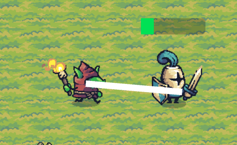

# ReNemiSys

## Overview

*"Unlike an Orc Boss, goblin bosses have to rely on their cunning rather than their strength."* – Ravening Hordes (TOW), Goblin Bosses

If you're going to be cunning you need to learn from your mistakes. **ReNemiSys** is my personal passion project that embodies this idea.
Inspired by the adaptive AI architecture of *Shadow of Mordor* and the looping narrative of *Re:Zero*, this project aims to create NPCs 
that learn and evolve with each encounter. In this game, not only the player but also the enemies evolve and grow more intelligent after each encounter. 
The result is a game where every battle is unique, ensuring players face progressively challenging and adaptive foes.

  

## Key Features
- **Dynamic Nemesis System**: NPCs adapt and evolve, growing stronger after each interaction and remembering how they were defeated.
- **Reinforcement Learning for AI**: NPC combat behavior driven by Deep Q Learning algorithms, enabling NPCs to learn and adjust tactics dynamically.
- **Memory and Adaptation**: Persistent memory of player encounters that NPCs use to enhance future strategies.
- **Hierarchical Structure**: NPCs belong to factions and ranks, moving up in a procedural hierarchy that shifts based on gameplay outcomes.

  

## Project Goals
1. **Adaptive NPC Behavior**: Implement a scalable AI framework where NPCs evolve their behaviors over time.
2. **Looping Game Mechanics**: Inspired by *Re:Zero*, the game resets after major events while NPCs retain knowledge of past encounters similar to a RougeLike game.
3. **Faction and Rank Management**: Introduce a system where NPCs are promoted or demoted, impacting power dynamics.
4. **Combat AI**: Develop an RL-based combat system where NPCs learn from battles and adapt accordingly.

## Tools and Frameworks
- **Godot Engine**: Powers the core game mechanics and logic. Also offers the core physics engine and environment for the agents to learn in.
- **C++ Node Extensions**: Enhances game engine capabilities for optimized performance.
- **Python (PyTorch, Scons)**: Handles C++ binding to the Godot Node structure.
- **SQLite/JSON**: Manages persistent data storage for NPC attributes and hierarchy.

## Development Phases
- [x] **Prototype Core Loop**: Build the game loop and basic nemesis evolution system.
    - Implement basic enemy AI.
    - Create initial player controls and interactions.
- [ ] **Integrate RL for Combat**: Implement RL-driven behavior for more intelligent NPCs.
    - Research appropriate RL algorithms for NPCs.
    - Implement training scripts and test integration.
- [ ] **Faction Management**: Develop the procedural hierarchy for promotions/demotions.
    - Design faction structure and promotion rules.
    - Implement logic for inter-faction interactions.
- [ ] **AI Refinement**: Balance and fine-tune NPC behaviors to ensure engaging gameplay.
    - Optimize RL parameters for improved NPC learning.
    - Conduct playtesting for balance adjustments.
- [ ] **Polish and Expand**: Add new features, improve visuals, and enhance overall gameplay.
    - Integrate advanced graphics and animations.
    - Add sound effects and background music.